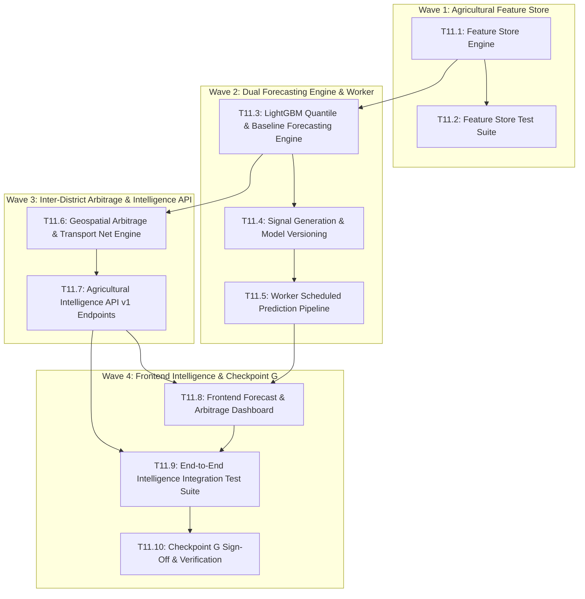

# Implementation Plan: Phase 11 — Agricultural Intelligence (v0.7 Architecture)

## Executive Summary

Phase 11 transitions FPOLink TN into an active **Agricultural Intelligence Platform**. Building directly on top of the verified Statewide Data Network (v0.6), Phase 11 introduces a standardized Agricultural Feature Store, dual-engine price forecasting (LightGBM Quantile Regression + Empirical Baseline with $\text{p10}-\text{p90}$ uncertainty intervals), inter-district price arbitrage with net transport margin calculations, autonomous daily prediction scheduling in the worker, and interactive intelligence visualization on the staff dashboard.

---

## Technical Constraints & Core Principles

- **Explainable Uncertainty:** Every forecast must provide upper ($\text{p90}$) and lower ($\text{p10}$) bounds in addition to median ($\text{p50}$) point estimates. No black-box point forecasts.
- **Fail-Safe Fallback:** If a commodity-market series has sparse historical data ($< 30$ observations), the system must seamlessly fall back to an empirical seasonal naive / rolling median baseline without throwing errors.
- **Net Economics in Arbitrage:** Price spread comparisons between markets must account for geospatial distance (Haversine formula) and estimated freight/transport costs per quintal to compute true net return.
- **Worker Isolation:** Model training and batch forecasting run in the background worker container (`fpolink-worker-1`), keeping the FastAPI API thread pool free and low-latency.
- **Zero Regression:** All 181 existing tests must remain 100% green throughout all execution waves.

---

## Wave Breakdown & Task Dependencies

---

## Detailed Task Specifications

### Wave 1: Agricultural Feature Store & Pipeline

#### Task 11.1: Feature Store Engine (`backend/app/ml/features.py`)
- **Goal:** Build an automated feature extraction engine that transforms raw price observations, arrival records, calendar attributes, and weather metrics into ML-ready tabular feature matrices.
- **Deliverables:**
  - Create `backend/app/ml/features.py` implementing `extract_features_for_series(df)`:
    - **Price Lags:** $t-1, t-2, t-3, t-7, t-14, t-30$ days modal prices.
    - **Rolling Statistics:** 7-day, 14-day, 30-day moving averages, standard deviation (price volatility), and spread ($\text{max} - \text{min}$).
    - **Arrival Volume Momentum:** 7-day volume rolling average and ratio ($A_t / \bar{A}_{7d}$).
    - **Tamil Calendar Features:** Integration with `holidays_tn.py` (`is_festival`, `days_to_nearest_festival`, month, day of week).
    - **Weather Features:** Forecast precipitation (mm) and temperature extremes mapped from Open-Meteo for market coordinates.
    - **Quality Weights:** Mapping `quality_score` to sample training weights.
  - Verification: Clean feature vector generation from historical price series without data leakage.

#### Task 11.2: Feature Store Test Suite (`backend/tests/test_feature_store.py`)
- **Goal:** Assert correctness of rolling windows, lag alignment, NaN imputation, and festival flags.
- **Deliverables:**
  - Test lag shifts ensure target prices at $t$ do not leak into input features for $t$.
  - Test handling of series with missing dates (forward-filling / rolling interpolation).
  - Test festival proximity calculations across Pongal and Tamil New Year dates.

---

### Wave 2: Dual Forecasting Engine & Worker Integration

#### Task 11.3: LightGBM Quantile & Baseline Forecasting Engine (`backend/app/ml/forecasting.py`)
- **Goal:** Implement the dual-engine price predictor: LightGBM quantile regression for series with sufficient history ($\ge 30$ observations) and seasonal naive / rolling median for sparse series.
- **Deliverables:**
  - Create `backend/app/ml/forecasting.py` with:
    - `train_market_crop_model(db, crop_id, market_id)`
    - `generate_forecast(db, crop_id, market_id, horizon_days=7)`
    - Quantile models trained for $\alpha = 0.10, 0.50, 0.90$.
    - Robust fallback returning median baseline with historical percentiles for sparse series.

#### Task 11.4: Signal Generation & Model Versioning
- **Goal:** Generate actionable farmer signals (Hold / Sell / Neutral) and persist forecasts into `predictions`, `model_versions`, and `forecast_log`.
- **Deliverables:**
  - Signal threshold logic:
    - `hold`: Expected price appreciation $> +5\%$ over current modal price within horizon.
    - `sell`: Expected price decline $> -5\%$ within horizon.
    - `neutral`: Stable trend within $\pm 5\%$.
  - Persist predictions into database: `predictions` table with `crop_id`, `market_id`, `predicted_price`, `lower_bound`, `upper_bound`, `confidence`, and `signal`.
  - Log model metadata into `model_versions` table.

#### Task 11.5: Worker Scheduled Prediction Pipeline
- **Goal:** Connect `run_predictions()` in `backend/app/worker.py` to trigger nightly forecast generation.
- **Deliverables:**
  - Update `backend/app/worker.py` to iterate over active crops and markets, generate 7-day forecasts, and log results.
  - Backtest evaluation job comparing yesterday's prediction against today's actual price in `forecast_log`.

---

### Wave 3: Inter-District Arbitrage & Intelligence API

#### Task 11.6: Geospatial Arbitrage & Transport Net Engine (`backend/app/services/arbitrage.py`)
- **Goal:** Calculate price spreads between mandis across districts and deduct estimated freight costs to surface true net arbitrage opportunities.
- **Deliverables:**
  - Create `backend/app/services/arbitrage.py` implementing `find_market_arbitrage(db, crop_id, origin_market_id, max_distance_km=250)`:
    - Compute Haversine distance between origin market and target markets using geocoordinates from `markets` table.
    - Estimate transport cost: $\text{Base ₹50/quintal} + \text{₹1.20/km/quintal}$.
    - Net spread: $\Delta P_{\text{net}} = \text{Modal}_{\text{target}} - \text{Modal}_{\text{origin}} - \text{TransportCost}$.
    - Rank opportunities by net profitability per quintal.

#### Task 11.7: Agricultural Intelligence API v1 Endpoints (`backend/app/api/v1/intelligence.py`)
- **Goal:** Expose versioned REST endpoints for price forecasts, price spreads, and market arbitrage.
- **Deliverables:**
  - Create Pydantic schemas in `backend/app/schemas/intelligence.py`.
  - Create `backend/app/api/v1/intelligence.py`:
    - `GET /api/v1/intelligence/forecast` (query params: `crop_id`, `market_id`, `days`)
    - `GET /api/v1/intelligence/spreads` (query params: `crop_id`, `district`)
    - `GET /api/v1/intelligence/arbitrage` (query params: `crop_id`, `origin_market_id`, `max_distance_km`)
    - `POST /api/v1/intelligence/train` (admin trigger for on-demand training)
  - Mount router in `backend/app/api/v1/__init__.py`.

---

### Wave 4: Frontend Intelligence & Verification Checkpoint G

#### Task 11.8: Frontend Forecast & Arbitrage Dashboard
- **Goal:** Surface price predictions with uncertainty envelopes and inter-market arbitrage matrices on the web dashboard.
- **Deliverables:**
  - Update `frontend/lib/api.ts` with API clients for intelligence endpoints.
  - Enhance `frontend/app/prices/page.tsx`:
    - Add multi-district dropdown selector (all 38 TN revenue districts).
    - Forecast chart rendering median line ($\text{p50}$) and shaded confidence envelope ($\text{p10} - \text{p90}$) using Recharts.
    - Actionable recommendation card with Hold / Sell / Neutral badges.
    - Nearby Market Arbitrage Matrix showing target mandi, distance (km), price spread, freight deduction, and net advantage per quintal.

#### Task 11.9: End-to-End Intelligence Integration Test Suite (`backend/tests/test_agricultural_intelligence.py`)
- **Goal:** Comprehensive integration testing verifying feature engineering, model inference, fallback behavior, arbitrage math, and API endpoints.
- **Deliverables:**
  - Test LightGBM inference produces valid $\text{p10} \le \text{p50} \le \text{p90}$ ordering.
  - Test fallback baseline behaves predictably on sparse historical data.
  - Test arbitrage correctly computes distance, transport costs, and net spreads.
  - Test all `/api/v1/intelligence/*` endpoints return HTTP 200 with verified schemas.

#### Task 11.10: Checkpoint G Sign-Off & Documentation
- **Goal:** Verify zero regressions, update project documentation, refresh the knowledge graph, and commit cleanly.
- **Deliverables:**
  - Update `tasks/todo.md` with Phase 11 tasks and Checkpoint G.
  - Update `README.md` and `docs/STATEWIDE_FOUNDATION.md`.
  - Execute `graphify update .`.
  - Push commit to git `origin main`.
