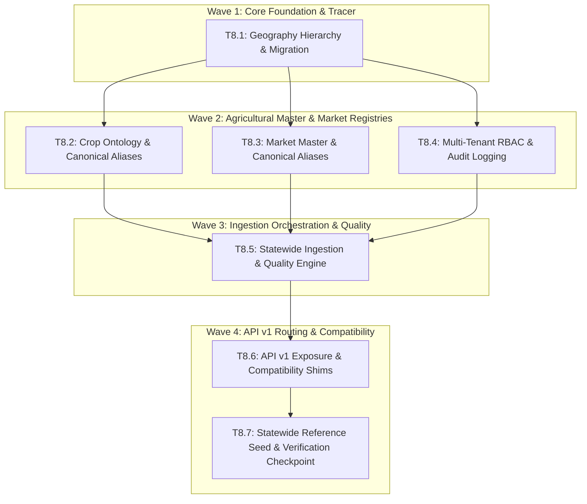

# Implementation Plan: Phase 8 — Statewide Platform Foundation (v0.5 Architecture)

## Executive Summary

Phase 8 executes the transition of FPOLink from an Erode-specific application into a **multi-tenant Tamil Nadu Agricultural Intelligence Platform**. It introduces a complete geographic hierarchy, agricultural ontology (crops + varieties + aliases), market registry + aliases, multi-tenant RBAC with organization scoping, audit logging, an explainable ingestion data-quality framework, and API v1 routes while maintaining 100% backward compatibility for the existing Erode pilot.

---

## Technical Constraints & Standards

- **Zero Breaking Changes:** Existing routes (`/api/prices/latest`, `/api/farmers/*`, `/api/whatsapp/*`) must remain fully functional.
- **Alembic Revisions:** Clean linear migration chain (`0006_statewide_foundation` following `0005_phase5_prod`).
- **Test Integrity:** All 145 existing tests must pass throughout every step, plus new comprehensive test coverage for all new models and services.
- **Provenance Discipline:** Synthetic data strictly confined to unit test fixtures. Master data loaded from verified Tamil Nadu agricultural datasets.

---

## Wave Breakdown & Task Dependencies

---

## Detailed Task Specifications

### Task 8.1: Tracer Vertical Slice — Geography Hierarchy & Alembic Migration
- **Goal:** Establish normalized geographic hierarchy (`State`, `District`, `Taluk`, `Block`, `Village`) and link foreign keys to `FPO`, `Farmer`, and `Market`.
- **Files to Create/Modify:**
  - Create `backend/app/models/geography.py`:
    - `State (id, name, code)`
    - `District (id, state_id, name, code, latitude, longitude)`
    - `Taluk (id, district_id, name)`
    - `Block (id, taluk_id, name)`
    - `Village (id, taluk_id, block_id, name)`
  - Update `backend/app/models/fpo.py`: add `state_id`, `district_id`, `taluk_id` foreign keys (nullable).
  - Update `backend/app/models/farmer.py`: add `state_id`, `district_id`, `taluk_id`, `village_id` foreign keys (nullable).
  - Update `backend/app/models/market.py`: add `state_id`, `district_id`, `taluk_id` foreign keys (nullable).
  - Update `backend/app/models/__init__.py`: export new models.
  - Create `backend/alembic/versions/0006_statewide_foundation.py`: Migration applying geography tables and foreign keys.
  - Create `backend/app/schemas/geography.py`: Pydantic models for states, districts, taluks, villages.
  - Create `backend/app/api/v1/geography.py`:
    - `GET /api/v1/geography/states`
    - `GET /api/v1/geography/districts`
    - `GET /api/v1/geography/districts/{id}/taluks`
    - `GET /api/v1/geography/taluks/{id}/villages`
  - Create `backend/tests/test_geography.py`: Migration and API tests.
- **Verification:**
  - `docker compose exec backend pytest tests/test_geography.py -v`
  - `docker compose exec backend alembic check`

---

### Task 8.2: Agricultural Ontology & Canonical Crop/Variety Registry with Aliases
- **Goal:** Expand Crop and Variety models to full agricultural ontology and build canonical alias resolution service.
- **Files to Create/Modify:**
  - Update `backend/app/models/crop.py`:
    - Add: `canonical_name`, `scientific_name`, `subcategory`, `default_unit`, `market_unit`, `season_type`, `water_requirement`, `perishability`, `storage_days`, `is_horticulture`, `is_commercial`, `is_active`.
  - Create `backend/app/models/crop_alias.py`:
    - `CropAlias (id, crop_id, alias, source, confidence)`
  - Update `backend/app/models/variety.py`:
    - Add: `canonical_name`, `grade`, `maturity_days`, `market_unit`.
  - Create `backend/app/models/variety_alias.py`:
    - `VarietyAlias (id, variety_id, alias, source)`
  - Create `backend/app/services/crop_resolver.py`:
    - `resolve_crop(name_or_alias: str, db: Session) -> Optional[Crop]`
    - `resolve_variety(crop_id: UUID, variety_or_alias: str, db: Session) -> Optional[Variety]`
  - Create `backend/app/schemas/crop.py` extensions for v1 API.
  - Create `backend/app/api/v1/crops.py`:
    - `GET /api/v1/crops`
    - `GET /api/v1/crops/{id}`
    - `GET /api/v1/crops/{id}/varieties`
    - `POST /api/v1/crops/resolve`
  - Create `backend/tests/test_crop_ontology.py`: Testing alias resolution (Tamil strings, Agmarknet IDs, English names).
- **Verification:**
  - `docker compose exec backend pytest tests/test_crop_ontology.py -v`

---

### Task 8.3: Market Master Registry & Canonical Market Aliases
- **Goal:** Upgrade Market master with geographic relationships and build canonical market alias resolution.
- **Files to Create/Modify:**
  - Update `backend/app/models/market.py`:
    - Add `code`, `is_active`, ensure `market_type` enum (regulated_market, uzhavar_sandhai, private_mandi).
  - Create `backend/app/models/market_alias.py`:
    - `MarketAlias (id, market_id, alias, source, confidence)`
  - Create `backend/app/services/market_resolver.py`:
    - `resolve_market(name_or_code: str, district_id: Optional[UUID], db: Session) -> Optional[Market]`
  - Create `backend/app/schemas/market.py`: Pydantic schemas for Market v1.
  - Create `backend/app/api/v1/markets.py`:
    - `GET /api/v1/markets`
    - `GET /api/v1/markets/{id}`
    - `POST /api/v1/markets/resolve`
  - Create `backend/tests/test_market_registry.py`: Testing market alias resolution and district filtering.
- **Verification:**
  - `docker compose exec backend pytest tests/test_market_registry.py -v`

---

### Task 8.4: Multi-Tenant RBAC, Organization Scoping & Audit Logging
- **Goal:** Support statewide multi-tenant roles (`STATE_ADMIN`, `DISTRICT_ADMIN`, `FPO_ADMIN`, etc.), tenant isolation enforcement, and audit trails.
- **Files to Create/Modify:**
  - Update `backend/app/models/user.py`:
    - Expand `UserRole`: `STATE_ADMIN`, `DISTRICT_ADMIN`, `FPO_ADMIN`, `FPO_STAFF`, `DATA_OPERATOR`, `ANALYST`, `BUYER`, `FIELD_AGENT`, `FARMER`.
    - Add `fpo_id` (UUID FK nullable), `district_id` (UUID FK nullable).
  - Create `backend/app/models/audit_log.py`:
    - `AuditLog (id, user_id, action, target_type, target_id, before_state, after_state, ip_address, created_at)`
  - Create `backend/app/services/audit.py`:
    - `log_audit_event(db, user_id, action, target_type, target_id, before_state, after_state, ip_address)`
  - Update `backend/app/api/deps.py`:
    - Add `require_tenant_scope()` to enforce tenant boundaries.
  - Create `backend/app/api/v1/admin/audit.py`:
    - `GET /api/v1/admin/audit-logs`
  - Create `backend/tests/test_multitenant_rbac.py`: Role and tenant barrier verification tests.
- **Verification:**
  - `docker compose exec backend pytest tests/test_multitenant_rbac.py -v`

---

### Task 8.5: Statewide Market Ingestion & Explainable Quality Scoring Framework
- **Goal:** Ingest multi-district market prices through canonical resolvers with explainable data quality scoring (0–100).
- **Files to Create/Modify:**
  - Create `backend/app/models/data_quality.py`:
    - `DataSource (id, name, code, priority, is_active)`
    - `IngestionRun (id, source_id, status, district, records_fetched, records_ingested, errors, started_at, completed_at)`
    - `DataQualityEvent (id, record_type, record_id, issue_type, penalty, details, created_at)`
  - Update `backend/app/models/market_price.py`:
    - Add `quality_score` (Float, 0.0 - 100.0)
    - Add `quality_breakdown` (JSONB)
  - Create `backend/app/services/data_quality.py`:
    - `calculate_quality_score(price_row, historical_rows, alias_confidence) -> (float, dict)`
  - Refactor `backend/app/services/ingestion.py`:
    - Integrate `CropResolver` and `MarketResolver`.
    - Apply `calculate_quality_score`.
    - Support multi-district batch loops.
    - Record execution in `IngestionRun`.
  - Create `backend/app/api/v1/prices.py`:
    - `GET /api/v1/prices/latest`
    - `GET /api/v1/prices/history`
    - `GET /api/v1/prices/quality-summary`
  - Create `backend/tests/test_statewide_ingestion.py`: Testing multi-district ingestion, quality score calculation, and anomaly detection.
- **Verification:**
  - `docker compose exec backend pytest tests/test_statewide_ingestion.py -v`

---

### Task 8.6: API v1 Routing & Compatibility Shims
- **Goal:** Mount the unified `/api/v1/` route hierarchy and confirm legacy `/api/*` endpoints forward transparently.
- **Files to Create/Modify:**
  - Create `backend/app/api/v1/__init__.py`: Router aggregator.
  - Update `backend/app/main.py`: Include `/api/v1` router alongside legacy `/api` routers.
  - Ensure legacy endpoints (`/api/prices/latest`, `/api/farmers/{fpo_id}`, etc.) delegate cleanly to the updated models and services.
  - Create `backend/tests/test_v1_compatibility.py`: Verify that both `/api/v1/*` and `/api/*` return identical, backwards-compatible data structures.
- **Verification:**
  - `docker compose exec backend pytest -v` (all 145+ tests must pass).

---

### Task 8.7: Statewide Reference Seed & Verification Checkpoint E
- **Goal:** Seed Tamil Nadu master data and execute the end-to-end statewide foundation verification suite.
- **Files to Create:**
  - Create `backend/scripts/seed_statewide_foundation.py`:
    - 38 Tamil Nadu districts.
    - Erode, Coimbatore, Thanjavur taluks & sample villages.
    - Tier-A commodities (20+ crops) with scientific names and aliases.
    - Initial regulated markets with geo-coordinates and aliases.
    - Default data sources (OGD, CEDA, TN AgriNet).
  - Create `docs/STATEWIDE_FOUNDATION.md`: Platform architecture guide and migration documentation.
- **Verification:**
  - Run seed script: `docker compose exec backend python scripts/seed_statewide_foundation.py`
  - Run full test suite: `docker compose exec backend pytest -v --tb=short`
  - Verify API endpoints return seeded master data.

---

## Checkpoint E: Statewide Platform Foundation Sign-Off
- [ ] Database migration `0006_statewide_foundation` applied cleanly.
- [ ] 38 Tamil Nadu districts queryable via `/api/v1/geography/districts`.
- [ ] Tier-A crop ontology queryable and alias resolution operational.
- [ ] Multi-tenant scoping and audit logs operational.
- [ ] Quality score computed and saved on new price observations.
- [ ] Full existing test suite green (145+ tests passing).
- [ ] Existing Erode dashboard at `http://localhost:3000` functions with zero degradation.
