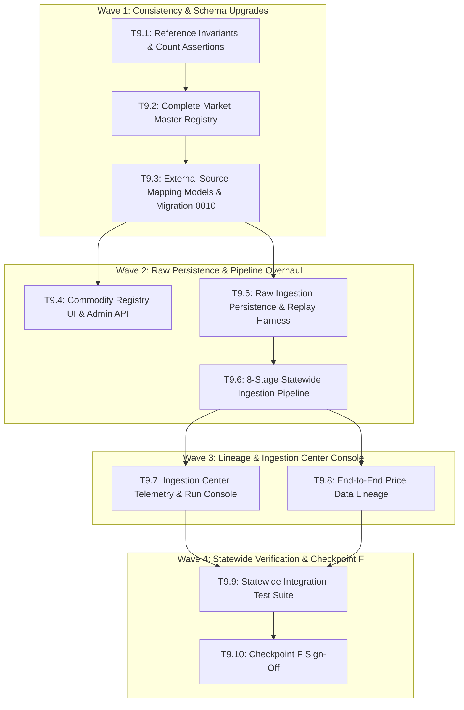

# Implementation Plan: Phase 9 — Statewide Data Network (v0.6 Architecture)

## Executive Summary

Phase 9 operationalizes FPOLink from an architectural foundation into a live, continuously updated **Statewide Data Network**. It expands the market master across all 38 districts of Tamil Nadu, implements deterministic external source mappings (eliminating pure fuzzy-matching risks), builds an immutable raw ingestion persistence layer with SHA-256 checksums, establishes an 8-stage data quality pipeline, provides end-to-end data lineage, and introduces the Commodity Registry and Ingestion Operations Console.

---

## Technical Constraints & Core Principles

- **The Golden Rule:** Never write a feature that assumes Erode. Erode is data, not code.
- **Zero Breaking Changes:** Backward compatibility for legacy `/api/*` endpoints and the live Erode pilot frontend (`http://localhost:3000`).
- **Data Lineage:** Every platform price observation must be traceable to its specific `IngestionRun` and `RawIngest` record.
- **Deterministic Resolution:** Precedence order: Exact External ID ──► Exact Canonical ──► Source Alias ──► Regional Alias ──► Fuzzy Match ──► Manual Review.
- **Test Integrity:** All 164 existing tests must remain green throughout all execution waves.

---

## Wave Breakdown & Task Dependencies

---

## Detailed Task Specifications

### Task 9.1: Reference Invariants & Automated Count Assertions
- **Goal:** Formalize compile-time and runtime validation asserting exact reference dataset counts.
- **Deliverables:**
  - `backend/scripts/seed_statewide_foundation.py`: Integrated strict assertions (38 districts, 20 Tier-A crops, 25 taluks, 8 pilot markets, 5 data sources).
  - `backend/tests/test_seed_reference_counts.py`: Automated CI assertions ensuring dataset invariants never degrade.
  - Verification: `docker compose exec backend pytest tests/test_seed_reference_counts.py -v`.

---

### Task 9.2: Complete Regulated Market Master Registry
- **Goal:** Expand `Market` master entity with canonical governance fields and seed the statewide regulated market network across Tamil Nadu.
- **Files to Modify/Create:**
  - Update `backend/app/models/market.py`:
    - Add `canonical_name` (String 150)
    - Add `tamil_name` (String 150, nullable)
    - Add `is_regulated` (Boolean, default True)
    - Add `e_nam` (Boolean, default False)
    - Add `operating_status` (String 20, default "active")
  - Expand `backend/scripts/seed_statewide_foundation.py` to seed major regulated mandis across all 38 Tamil Nadu districts (Madurai, Salem, Tiruchirappalli, Dindigul, Tirunelveli, Thanjavur, Vellore, Dharmapuri, etc.) with coordinates and district linkages.
  - Update `backend/app/schemas/market.py` and `backend/app/api/v1/markets.py`.
- **Verification:**
  - `SELECT COUNT(DISTINCT district_id) FROM markets;` equals 38.

---

### Task 9.3: External Source Mapping Models & Migration 0010
- **Goal:** Create explicit source-to-canonical mapping entities to eliminate pure fuzzy matching dependency.
- **Files to Create/Modify:**
  - Create `backend/app/models/source_mapping.py`:
    - `CropSourceMapping (id, crop_id, source_id, external_code, external_name, confidence, verified_at)`
    - `MarketSourceMapping (id, market_id, source_id, external_code, external_name, confidence, verified_at)`
    - `VarietySourceMapping (id, variety_id, source_id, external_code, external_name, confidence, verified_at)`
  - Register in `backend/app/models/__init__.py`.
  - Create migration `backend/alembic/versions/0010_source_mappings_and_market_expansion.py`.
  - Update `backend/app/services/crop_resolver.py` and `backend/app/services/market_resolver.py` to check source mappings as Stage 1 priority.
- **Verification:**
  - `alembic check` clean; source mapping unit tests pass.

---

### Task 9.4: Commodity Registry UI & Admin API
- **Goal:** Build `/admin/commodities` admin console and `/api/v1/commodities` endpoints.
- **Files to Create/Modify:**
  - Create `backend/app/api/v1/commodities.py`:
    - `GET /api/v1/commodities`: List canonical crops with varietal count, alias count, active markets, and source mapping status.
    - `GET /api/v1/commodities/{crop_id}`: Detailed crop intelligence metadata.
  - Mount router in `backend/app/api/v1/__init__.py`.
  - Create Next.js screen `frontend/app/admin/commodities/page.tsx`:
    - Searchable list of commodities with Tamil names, categories, and varietal badges.
    - Detail drawer showing aliases, source mappings, and reporting mandis.
- **Verification:**
  - Admin commodity registry browsable in frontend; API tests passing.

---

### Task 9.5: Raw Ingestion Persistence & Replay Harness
- **Goal:** Ensure every raw observation is preserved immutably with SHA-256 checksums and replay capabilities.
- **Files to Create/Modify:**
  - Update `backend/app/models/raw_ingest.py`:
    - Add `source_record_id` (String 100, nullable)
    - Add `checksum` (String 64, index=True)
    - Add `retrieved_at` (DateTime, server_default=now)
  - Create `backend/scripts/replay_raw_ingestion.py`:
    - Re-processes stored raw payloads through the current normalization pipeline without contacting external APIs.
- **Verification:**
  - Test replaying raw records produces identical normalized entries.

---

### Task 9.6: 8-Stage Statewide Ingestion Pipeline
- **Goal:** Implement the complete 8-stage pipeline in `IngestionService`.
- **Pipeline Stages:**
  1. Immutable Raw Ingest & Checksum check (dedup at raw layer)
  2. Schema Validation via Pydantic `PriceRecord`
  3. Source Mapping / External ID lookup (OGD/Agmarknet codes)
  4. Canonical Entity Resolution (`resolve_crop`, `resolve_market`)
  5. Unit & Currency Normalization (`raw_price` / `raw_unit` -> modal ₹/kg)
  6. Geographic Validation (District / State verification)
  7. Deduplication & MAD Outlier Penalty calculation
  8. Explainable Quality Score (0–100) computation
- **Files to Modify:**
  - `backend/app/services/ingestion.py`
- **Verification:**
  - Multi-district simulated OGD batch runs without errors and produces valid `MarketPrice` entries with explainable quality scores.

---

### Task 9.7: Ingestion Center Telemetry & Run Console
- **Goal:** Upgrade `/admin/ingestion` into a full data engineering console.
- **Files to Create/Modify:**
  - Create `backend/app/api/v1/ingestion.py`:
    - `GET /api/v1/ingestion/runs`: Paginated run history with status, records fetched/ingested/rejected.
    - `GET /api/v1/ingestion/runs/{run_id}`: Detailed run breakdown, rejection taxonomy (`unknown_market`, `unknown_crop`, `invalid_price`, `duplicate`, `outlier`), and error log.
    - `GET /api/v1/ingestion/freshness`: Statewide coverage stats (reporting districts, markets, crops).
  - Update frontend `frontend/app/admin/page.tsx` (or dedicated `/admin/ingestion` tab) to render run telemetry cards and rejection analytics.
- **Verification:**
  - API returns structured telemetry and frontend renders live operational metrics.

---

### Task 9.8: End-to-End Price Data Lineage
- **Goal:** Provide full provenance from frontend price quote back to the raw source packet.
- **Files to Modify:**
  - Update `backend/app/models/market_price.py`:
    - Add `ingestion_run_id` (UUID FK nullable to `ingestion_runs.id`)
    - Add `raw_ingest_id` (UUID FK nullable to `raw_ingest.id`)
  - Create `GET /api/v1/prices/{price_id}/lineage` in `backend/app/api/v1/prices.py`:
    - Returns full lineage path: Source -> Raw Ingest -> Run ID -> Normalized Price -> Quality breakdown.
- **Verification:**
  - Lineage query returns complete provenance chain.

---

### Task 9.9: Statewide Integration & Regression Test Suite
- **Goal:** Comprehensive automated validation across all 38 districts and statewide features.
- **Files to Create:**
  - `backend/tests/test_source_mappings.py`: External source mapping resolution.
  - `backend/tests/test_raw_replay.py`: Raw payload checksum and replay fidelity.
  - `backend/tests/test_data_lineage.py`: Price-to-raw traceability verification.
  - `backend/tests/test_statewide_coverage.py`: Multi-district ingestion and market coverage assertions.
- **Verification:**
  - Full test suite passes (>175 passing tests, 0 regressions on baseline pilot).

---

### Task 9.10: Checkpoint F Statewide Data Network Sign-Off
- **Criteria:**
  - [ ] Migration `0010_source_mappings_and_market_expansion` applied cleanly.
  - [ ] All 38 districts have at least one canonical regulated market registered.
  - [ ] Source mapping tables active and deterministic resolution operational.
  - [ ] 8-stage ingestion pipeline operational with raw persistence and SHA-256 deduplication.
  - [ ] Data lineage traceable from `MarketPrice` to `RawIngest`.
  - [ ] Ingestion Center and Commodity Registry accessible via API and web UI.
  - [ ] Zero regressions on existing Erode pilot frontend and WhatsApp bot.
  - [ ] Entire test suite green (100% pass rate).
